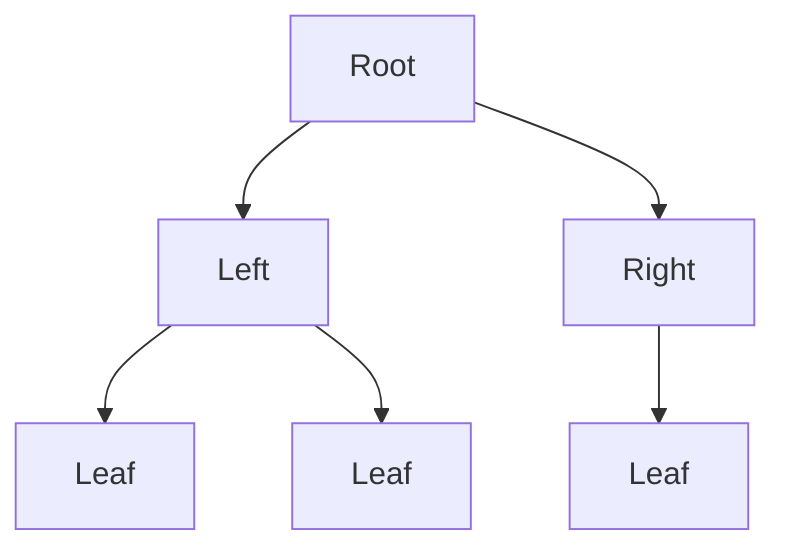

<!-- vim: set spell spelllang=en: -->
# Sowing

**Sowing** is a Python library that provides an **immutable tree** data structure, along with utilities to **build, traverse, edit, and serialize trees**.
Some advantages of using such a structure include:

- Subtrees can be reused in multiple trees, reducing the memory footprint.
- Passing trees between functions and/or threads is safe and never requires unnecessary copying.
- Trees can be hashed, placed in sets, and used as keys in dictionaries.
- It simplifies reasoning about the resulting code, as there are no side-effects.

This library also provides efficient tools to traverse and edit trees, despite the immutable structure, borrowing ideas from [Huet’s Zipper](#references).

## Using the library

1. [Manually building trees](#manually-building-trees)
1. [(De)serializing trees](#deserializing-trees)
1. [Navigating within trees](#navigating-within-trees)
1. [Editing trees](#editing-trees)
1. [Indexed trees](#indexed-trees)
1. [Combinatorial tools](#combinatorial-tools)

### Manually building trees

`Node` is the main data structure. 
It is an immutable, hashable, and recursive structure.
Each `Node` instance represents a subtree; it contains the root of that subtree and links to `Node` for each of its child subtrees.

Create tree structures by manually instantiating `Node`.
For example, the tree below can be represented as follows:



```py
from sowing import Node
tree = (
    Node("Root")
    .add(
        Node("Left")
        .add(Node("Leaf"))
        .add(Node("Leaf"))
    )
    .add(
        Node("Right")
        .add(Node("Leaf"))
    )
)
```

Nodes can contain any arbitrary data, as long as it is immutable and hashable.
In the previous example, strings were attached to each node.
Note that native Python dictionaries are _not_ immutable, so they cannot be attached to a node.
To store key-value data inside a node, you should use an immutable dictionary library such as [`immutables`](https://github.com/MagicStack/immutables).

Trees can be pretty-printed to reveal their structure:

```py
>>> print(tree)
Root
├──Left
│  ├──Leaf
│  └──Leaf
└──Right
   └──Leaf
```

Two nodes compare equal as long as their data is equal and their subtrees are also equal.
The order among subtrees of a node is significant in this comparison.
For example:

```py
>>> Node("Example") == Node("Example")
True
>>> Node().add(Node()).add(Node()) == Node().add(Node()).add(Node())
True
>>> Node("a").add(Node("b")).add(Node("c")) == Node("a").add(Node("b")).add(Node("c"))
True
>>> Node("a").add(Node("b")).add(Node("c")) == Node("a").add(Node("c")).add(Node("b"))
False
```

Edges between nodes can also contain any arbitrary immutable and hashable data.
This data is specified by passing the `data=` keyword argument to the `add()` method.
For example:

```py
>>> tree = (
    Node("Root")
    .add(
        Node("Left")
        .add(Node("Leaf"))
        .add(Node("Leaf")),
        data="towards left"
    )
    .add(
        Node("Right")
        .add(Node("Leaf")),
        data="towards right"
    )
)
>>> print(tree)
Root
│  ╭towards left
├──Left
│  ├──Leaf
│  └──Leaf
│  ╭towards right
└──Right
   └──Leaf
```

### (De)serializing trees

Sowing supports reading and writing trees in the [extended **Newick** format](https://en.wikipedia.org/wiki/Newick_format).
Here is an example showing how to read a tree from its serialized Newick form and then serialize it back to Newick:

```py
>>> from sowing.repr.newick import parse, write
>>> data = "(((ab,ac),(b,a)),(((c,c),acd),d));"
>>> newick = parse(data)
>>> assert write(newick) == data
>>> print(newick)
┐
├──┐
│  ├──┐
│  │  ├──{'name': 'ab'}
│  │  └──{'name': 'ac'}
│  └──┐
│     ├──{'name': 'b'}
│     └──{'name': 'a'}
└──┐
   ├──┐
   │  ├──┐
   │  │  ├──{'name': 'c'}
   │  │  └──{'name': 'c'}
   │  └──{'name': 'acd'}
   └──{'name': 'd'}
```

In the Newick format, any number of pieces of information can be attached to a node or an edge.
If a node has a name, it will be parsed and stored inside an immutable dictionary under the `"name"` key, as shown above.
Branch lengths and supports can be specified using the usual colon notation, as in the following example:

```py
>>> print(parse("(a:1,b::2,c:3:4);"))
┐
│  ╭{'length': '1'}
├──{'name': 'a'}
│  ╭{'support': '2'}
├──{'name': 'b'}
│  ╭{'length': '3', 'support': '4'}
└──{'name': 'c'}
```

Following the extended Newick format, other arbitrary attributes can be specified using the bracket notation.
Attributes placed before the first colon belong to the node, while those placed afterwards belong to the parent edge.

```py
>>> print(parse("(a:1[&edgeattr=val],b[&nodeattr=val]::2,c:3:4);"))
┐
│  ╭{'edgeattr': 'val', 'length': '1'}
├──{'name': 'a'}
│  ╭{'support': '2'}
├──{'nodeattr': 'val', 'name': 'b'}
│  ╭{'length': '3', 'support': '4'}
└──{'name': 'c'}
```

While the deserialization-serialization process is guaranteed to be non-destructive (i.e. `write(parse(data))` always equals `data`), the reverse is not true (for some trees, `parse(write(tree))` differs from `tree`).
Any non-dictionary data encountered while serializing a tree is silently ignored.

### Navigating within trees

`Node` and `Edge` instances have a `data` attribute containing the data attached to them.
Additionally, each node has an `edges` attribute containing a list of edges to its children, and each edge has a `node` attribute referencing the subtree it points to.
By design, nodes have no reference to their parents.

To easily navigate within trees, use **zippers**, which are a kind of **cursor** keeping track of your position and allowing you to easily jump to the parent, children, or siblings of a node.
To obtain a cursor pointing on the root of a tree, use the `unzip()` method.
The `node` attribute on cursors contains the currently pointed node.

The following navigation methods are available on cursors:

- `cursor.down([index])` — Move to the n<sup>th</sup> child of the current node, by default the first one.
- `cursor.children()` — Get an iterator on the children of the current node.
- `cursor.up()` — Move to the parent of the current node.
- `cursor.sibling([index])` — Move to the n<sup>th</sup> sibling of the current node, by default the next one.

For example:

```py
>>> from sowing import Node
>>> tree = (
    Node("Root")
    .add(Node("Left").add(Node("Leaf")).add(Node("Leaf")))
    .add(Node("Right").add(Node("Leaf")))
)
>>> print(tree)
Root
├──Left
│  ├──Leaf
│  └──Leaf
└──Right
   └──Leaf
>>> tree.unzip().down().down().node.data
'Leaf'
>>> tree.unzip().down().sibling().node.data
'Right'
>>> print(tree.unzip().down().sibling())
Root
├──Left
│  ├──Leaf
│  └──Leaf
└──○ Right
   └──Leaf
```

When printing a cursor, the circle (○) symbol marks the current node.

The `sowing.traversal` module provides functions to traverse trees in the following orders:

- `depth(tree, [preorder=False])` — Get an iterator on the nodes of a tree in [depth-first order](https://en.wikipedia.org/wiki/Depth-first_search), either in postorder (the default), where parents get enumerated after their children, or in preorder, where parents get enumerated first.
- `leaves()` — Get an iterator on the leaves of a tree, following the tree order.
- `euler()` — Get an iterator visiting the nodes of a tree along an [Euler tour of its edges](https://en.wikipedia.org/wiki/Euler_tour_technique).

For example:

```py
>>> from sowing.traversal import depth, euler, leaves
>>> for cursor in depth(tree, preorder=False):
>>>     print(cursor.node.data)
Leaf
Leaf
Left
Leaf
Right
Root

>>> for cursor in depth(tree, preorder=True):
>>>     print(cursor.node.data)
Root
Left
Leaf
Leaf
Right
Leaf

>>> for cursor in leaves(tree):
>>>     print(cursor.node.data)
Leaf
Leaf
Leaf

>>> for cursor in euler(tree):
>>>     print(cursor.node.data)
Root
Left
Leaf
Left
Leaf
Left
Root
Right
Leaf
Right
Root
```

### Editing trees

Modifying part of the tree can be tedious, since any change to a given node must be propagated recursively through its ancestors up to the root.
[**Cursors**](#navigating-within-trees) provide an easy and efficient solution to this issue by allowing to change the currently pointed node in constant time.
After edits are done, the `zip()` method computes the final tree structure, automatically propagating all changes towards the root.
This leaves the original tree unchanged, since it is, after all, immutable.

To update nodes, edges and cursors, `replace()` methods are available on each class.
A call to `obj.replace(a=b, c=d)` returns a new copy of `obj` in which the value of the `a` field has been replaced by `b`, `c` replaced by `d`, and all other fields are left unchanged.
Values can either be plain or callable.
In the latter case, the callable is invoked with a reference to `obj` in order to compute the actual value used for the replacement.

Here are some examples:

```py
# Given the following structure...
>>> from sowing import Node
>>> tree = (
    Node("Root")
    .add(Node("Left").add(Node("Leaf")).add(Node("Leaf")), data="towards left")
    .add(Node("Right").add(Node("Leaf")), data="towards right")
)
>>> print(tree)
Root
│  ╭towards left
├──Left
│  ├──Leaf
│  └──Leaf
│  ╭towards right
└──Right
   └──Leaf

# ...change the data associated to the right child
>>> print(tree.unzip().down(1).replace(node=lambda x: x.replace(data="New")).zip())
Root
│  ╭towards left
├──Left
│  ├──Leaf
│  └──Leaf
│  ╭towards right
└──New
   └──Leaf

# ...change the data on the edge to the left child
>>> print(tree.unzip().down(0).replace(data="changed").zip())
Root
│  ╭changed
├──Left
│  ├──Leaf
│  └──Leaf
│  ╭towards right
└──Right
   └──Leaf

# ...remove the left subtree
>>> print(tree.unzip().down(0).replace(node=None).zip())
Root
│  ╭towards right
└──Right
   └──Leaf

# ...swap the two subtrees below the root
>>> print(tree.unzip().down(0).replace(index=1).zip())
Root
│  ╭towards right
├──Right
│  └──Leaf
│  ╭towards left
└──Left
   ├──Leaf
   └──Leaf

# ...use another node as the root
>>> print(tree.unzip().down(0).root().zip())
Left
├──Leaf
├──Leaf
│  ╭towards left
└──Root
   │  ╭towards right
   └──Right
      └──Leaf
```

### Indexed trees

**Indexed trees** allow random access to any subtree of a given structure in constant time, using the data associated to the tree as a lookup key.
To be indexable, each node of a tree must contain a string, or a mapping with a `"name"` key mapped to a string.
Additionally, no two nodes can share the same key.

A tree can be indexed by instantiating the `IndexedTree` class and passing it the desired tree.
The following methods are available on an indexed tree:

- `index[key]` — Retrieve a cursor pointing to the node named `key`
- `index(key1, key2, ...)` — Retrieve a cursor pointing to the lowest common ancestor (LCA) of all nodes bearing the keys `key1`, `key2`, ...
- `index.is_ancestor_of(key1, key2)` — Check if the node `key1` is an ancestor or equal to the node `key2`
- `index.is_strict_ancestor_of(key1, key2)` — Check if the node `key1` is an ancestor and different from the node `key2`
- `index.is_comparable(key1, key2)` — Check if the node `key1` is an ancestor, a descendant, or equal to the node `key2`
- `index.depth(key)` — Retrieve the depth of the node `key`, i.e., its distance to the root
- `index.distance(key1, key2)` — Retrieve the distance between the nodes `key1` and `key2`

Here is an example of indexing a tree parsed from a Newick string:

```py
>>> from sowing.indexed import IndexedTree
>>> from sowing.repr.newick import parse
>>> tree = parse("(((a,b)c,(d,e)f)g,(h,i)j)k;")
>>> print(tree)
>>> index = IndexedTree(tree)
{'name': 'k'}
├──{'name': 'g'}
│  ├──{'name': 'c'}
│  │  ├──{'name': 'a'}
│  │  └──{'name': 'b'}
│  └──{'name': 'f'}
│     ├──{'name': 'd'}
│     └──{'name': 'e'}
└──{'name': 'j'}
   ├──{'name': 'h'}
   └──{'name': 'i'}

# Retrieve a node by its key
>>> print(index["a"].node)
{'name': 'a'}

# Find the lowest common ancestor (LCA) of multiple nodes
>>> print(index("a", "d", "e").node)
{'name': 'g'}
├──{'name': 'c'}
│  ├──{'name': 'a'}
│  └──{'name': 'b'}
└──{'name': 'f'}
   ├──{'name': 'd'}
   └──{'name': 'e'}

# Query ancestry relationships
>>> index.is_ancestor_of("g", "a")
True
>>> index.is_ancestor_of("a", "g")
False
>>> index.is_ancestor_of("a", "a")
True
>>> index.is_comparable("a", "k")
True
>>> index.is_comparable("a", "b")
False

# Query depth and distance
>>> index.depth("a")
3
>>> index.depth("k")
0
>>> index.distance("a", "b")
2
>>> index.distance("a", "e")
4
>>> index.distance("b", "h")
5
```

### Combinatorial tools

Sowing also provides some basic tools for generating and enumerating trees.

#### Binarization

The `sowing.comb.binary` module provides a `binarize` function which can transform any tree into a binary tree by inserting internal nodes.

```py
>>> from sowing.repr.newick import parse
>>> tree = parse("((a,b,c,d),(e,f),g,(h,i,j));")
>>> print(tree)
┐
├──┐
│  ├──{'name': 'a'}
│  ├──{'name': 'b'}
│  ├──{'name': 'c'}
│  └──{'name': 'd'}
├──┐
│  ├──{'name': 'e'}
│  └──{'name': 'f'}
├──{'name': 'g'}
└──┐
   ├──{'name': 'h'}
   ├──{'name': 'i'}
   └──{'name': 'j'}

# Generate the first possible binarization of the tree
>>> from sowing.comb.binary import binarize
>>> print(next(binarize(tree)))
┐
├──┐
│  ├──┐
│  │  ├──┐
│  │  │  ├──┐
│  │  │  │  ├──┐
│  │  │  │  │  ├──{'name': 'a'}
│  │  │  │  │  └──{'name': 'b'}
│  │  │  │  └──{'name': 'c'}
│  │  │  └──{'name': 'd'}
│  │  └──┐
│  │     ├──{'name': 'e'}
│  │     └──{'name': 'f'}
│  └──{'name': 'g'}
└──┐
   ├──┐
   │  ├──{'name': 'h'}
   │  └──{'name': 'i'}
   └──{'name': 'j'}

# Count the number of possible binarizations
>>> sum(1 for _ in binarize(tree))
675
```

#### Supertrees

The `sowing.comb.supertree` module builds trees which “display” the topology a set of given trees, implementing the [BreakUp and AllTrees algorithms from Ng and Wormald](#references).

```py
>>> from sowing.repr.newick import parse
>>> trees = (
    parse("((a,c),(d,e));"),
    parse("((a,b),c);"),
    parse("(d,(f,g));"),
)

# Generate the first possible supertree
>>> print(next(supertree(*trees)))
┐
├──┐
│  ├──┐
│  │  ├──{'name': 'a'}
│  │  └──{'name': 'b'}
│  └──{'name': 'c'}
├──┐
│  ├──{'name': 'd'}
│  └──{'name': 'e'}
└──┐
   ├──{'name': 'f'}
   └──{'name': 'g'}

# Generate the first possible _binary_ supertree
>>> print(next(supertree(*trees, arity=2)))
┐
├──┐
│  ├──┐
│  │  ├──{'name': 'a'}
│  │  └──{'name': 'b'}
│  └──{'name': 'c'}
└──┐
   ├──{'name': 'd'}
   └──┐
      ├──{'name': 'e'}
      └──┐
         ├──{'name': 'f'}
         └──{'name': 'g'}

# Count the number of possible supertrees
>>> sum(1 for _ in supertree(*trees))
75
>>> sum(1 for _ in supertree(*trees, arity=2))
41
```

## References

- Huet, Gérard. [“The zipper.”](https://doi.org/10.1017/S0956796897002864) Journal of functional programming 7.5 (1997): 549-554
- [Zipper implementation in Scala](https://stanch.github.io/zipper/) by Nick Stanchenko
- Ng, Meei Pyng, and Nicholas C. Wormald. [“Reconstruction of rooted trees from subtrees.”](https://doi.org/10.1016/0166-218X(95)00074-2) Discrete applied mathematics 69.1-2 (1996): 19-31.

## License and acknowledgments

This library is distributed under the GPL-3.0 license.
[See license text.](LICENSE)
